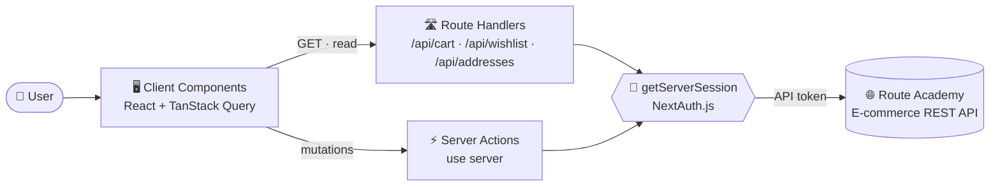
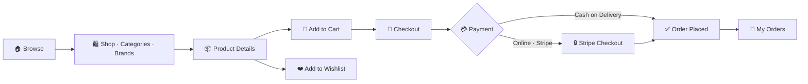

<div align="center">


# 🛒 FreshCart

### A modern, full-stack e-commerce experience built with Next.js

Browse · Wishlist · Cart · Checkout · Track your orders — all in one fast, responsive storefront.

<br/>


<br/><br/>


<br/>

[🌐 **Live Demo**](https://YOUR-DEPLOYMENT.vercel.app) &nbsp;•&nbsp; [✨ Features](#-features) &nbsp;•&nbsp; [🧰 Tech Stack](#-tech-stack) &nbsp;•&nbsp; [🧩 Architecture](#-architecture) &nbsp;•&nbsp; [🚀 Getting Started](#-getting-started)

</div>

---

## ✨ Overview

**FreshCart** is a complete online grocery & lifestyle store. It covers the entire shopping journey — from discovering products and saving favourites, to managing a cart, choosing a delivery address, paying **online or in cash**, and reviewing past orders.

The project is built with the **Next.js App Router**, uses **Server Actions** for secure mutations, **TanStack Query** for instant, cache-driven UI updates, and **NextAuth.js** for authentication — all talking to the Route Academy E-commerce REST API.

<div align="center">

| 📄 Pages | 🔌 API Endpoints | 📱 Responsive | 🔐 Auth & Payments |
| :---: | :---: | :---: | :---: |
| **16** | **25+** | **Mobile → Desktop** | **Credentials · Cash · Stripe** |

</div>

### 🎨 Design Language

 **Emerald** — primary brand colour &nbsp;
 **Slate** — text & dark surfaces &nbsp;
 **Pink** — wishlist accents &nbsp;
 **Amber** — ratings

Typography uses the **Exo** font via `next/font`, with rounded cards, soft shadows, and consistent gradient hero banners across pages.

---

## 🧰 Tech Stack

**Languages**


**Core**

| Technology | Badge | Purpose |
| --- | :---: | --- |
| **Next.js (App Router)** |  | Routing, Server Components, Server Actions, Route Handlers |
| **React** |  | UI library |
| **TypeScript** |  | Type-safe models, props and API responses |

**Data, State & Forms**

| Technology | Badge | Purpose |
| --- | :---: | --- |
| **TanStack Query** |  | Server-state caching, mutations, cache invalidation |
| **React Hook Form** |  | Performant form handling |
| **Zod** |  | Schema validation (login & register) |

**Authentication & Payments**

| Technology | Badge | Purpose |
| --- | :---: | --- |
| **NextAuth.js** |  | Credentials provider, JWT session, protected data access |
| **jwt-decode** |  | Reading the user id from the API token |
| **Stripe** |  | Hosted online payment (Checkout Session) |

**UI & Styling**

| Technology | Badge | Purpose |
| --- | :---: | --- |
| **Tailwind CSS** |  | Utility-first responsive styling |
| **shadcn/ui** |  | Accessible UI primitives (field, input, navigation menu, toast) |
| **Swiper** |  | Hero slider with autoplay & navigation |
| **Heroicons** |  | Icon set |
| **Lucide** |  | Icon set (navbar & footer) |
| **react-spinners** |  | Page loading indicator |

**Tooling & Deployment**


---

## 🎯 Features

### 🔐 Authentication & Account

- **Register** — validated with **Zod + React Hook Form**: name, email, strong password (upper/lower/number/symbol), password confirmation, Egyptian phone format, and terms acceptance.
- **Login** — NextAuth **Credentials** provider with a **JWT session**; the API token is stored in the session and used by all protected requests. Includes show/hide password and toast feedback.
- **Forgot Password** — a guided **3-step flow** with a progress stepper: *email → 6-digit verification code → new password*.
- **Change Password** — available from the profile page (current / new / confirm).
- **Session-aware UI** — the top bar greets the user by name; wishlist, cart, account menu and logout only appear when signed in.

### 🏠 Homepage

- **Top bar** with shipping/offer highlights and contact info.
- **Smart navbar** — search, navigation links, support block, **live wishlist & cart counters**, and an account dropdown (*My Account · My Orders · My Addresses*), plus a full **mobile menu**.
- **Hero slider** — Swiper carousel with autoplay, pagination dots, custom arrows and a green overlay.
- **Perks strip** — Free Shipping · Secure Payment · Easy Returns · 24/7 Support.
- **Shop by Category** grid and **Featured Products**.
- **Promo banners** with discount codes.
- **Newsletter & mobile-app section** and a rich **footer** (link columns, contact, social, payment methods).

### 🛍️ Catalog

- **Shop** — all products in a responsive grid with **instant client-side search** (no page reload).
- **Product card** — rating stars, sale badge, discounted/original price, one-click **add to cart**, and **wishlist** toggle.
- **Product details** — image gallery, category & brand chips, rating, price with discount, **stock status**, quantity selector limited by available stock, and total price.
- **Brands** — listing with a hero header, plus a **Brand details** page.
- **Categories** — listing with a hero header, plus a **Category details** page.
- The API service layer supports **category, brand, keyword, sorting, pagination and price-range filters**.

### 🛒 Cart

- **Add** from product cards and the product details page.
- **Update quantity** (＋ / −), **remove** items, and see live **subtotal & total**.
- **Live counter** in the navbar — the UI syncs instantly through **TanStack Query cache invalidation**.
- Friendly **empty state** and a direct **Proceed to checkout** action.

### ❤️ Wishlist

- **Add / remove** products from anywhere with one click.
- Dedicated **Wishlist page** with a responsive product grid.
- Pink **counter badge** on the navbar heart icon.

### 💳 Checkout & Payments

- Choose a **saved address** or enter a **new one** on the fly.
- Two payment methods:
  - 💵 **Cash on Delivery** — creates the order directly.
  - 💳 **Online payment** — creates a **Stripe Checkout session** and redirects to the secure hosted page.
- Clear **order summary** (items, subtotal, shipping, total) and a single **Place Order** action.

### 📦 Orders & Addresses

- **My Orders** — review previous orders and their details.
- **My Addresses** — add, list and delete delivery addresses (reused directly inside checkout).

### 👤 Profile

- **Account settings** page with a sidebar layout.
- Update **name, email and phone**, and **change password** securely.

### 🎨 UI / UX

- Fully **responsive** — from phones to large desktops.
- **Toast notifications** for every success / error.
- **Loading states** (`loading.tsx` with a bar loader) and graceful empty states.
- **Optimised images** through `next/image`.
- Accessible labels (`aria-label`) on icon-only buttons.

---

## ✅ Requirements Checklist

| Area | Requirement | Status |
| --- | --- | :---: |
| **Authentication** | Login · Register · Forgot Password · Change Password | ✅ |
| **Homepage** | Complete homepage with all sections | ✅ |
| **Listing & Details** | Products · Product Details · Brands · Brand Details · Categories · Category Details | ✅ |
| **Cart** | Display · Add · Remove · Update | ✅ |
| **Wishlist** | Display · Add · Remove | ✅ |
| **Payment** | Online & Cash | ✅ |
| **Orders** | My Orders page | ✅ |
| **Address** | Add · List · Remove + use in checkout | ✅ |

### 🧭 Pages & Routes

| Route | Description | Access |
| --- | --- | :---: |
| `/` | Homepage | 🌍 Public |
| `/shop` | All products + search | 🌍 Public |
| `/ProductDetails/[id]` | Product details | 🌍 Public |
| `/brands` · `/brands/[id]` | Brands & brand details | 🌍 Public |
| `/categories` · `/categories/[id]` | Categories & category details | 🌍 Public |
| `/login` · `/register` · `/forgot-password` | Authentication | 🌍 Public |
| `/cart` | Shopping cart | 🔒 Login required |
| `/wishlist` | Wishlist | 🔒 Login required |
| `/checkout` | Address + payment + order summary | 🔒 Login required |
| `/orders` | Order history | 🔒 Login required |
| `/addresses` | Address book | 🔒 Login required |
| `/profile` | Account settings | 🔒 Login required |

---

## 🧩 Architecture

### How data flows



### The shopping journey



### Key decisions

1. **Reads through Route Handlers, writes through Server Actions.** Protected data (cart, wishlist, addresses) is fetched from `/api/*` routes, while every mutation is a `'use server'` action — the API token never reaches the browser code.
2. **One source of truth for the token.** Both layers read the session with `getServerSession(authOptions)`, so behaviour is identical in development and in production.
3. **Instant UI with cache invalidation.** After each mutation, `queryClient.invalidateQueries()` refreshes the relevant query (`getCart`, `getWishlist`, `getAddresses`) so counters and lists update without a page refresh.
4. **Production-safe fetching.** Protected route handlers use `export const dynamic = 'force-dynamic'` and `cache: 'no-store'` so Next.js never serves stale cart/wishlist data.
5. **Type safety end-to-end.** API responses are described with TypeScript interfaces, and form types are inferred from Zod schemas.

---

## 📁 Project Structure

> Simplified view of the main folders.

```text
frash-cart/
├── app/
│   ├── (auth)/
│   │   ├── login/
│   │   └── register/
│   ├── -component/              # Reusable UI: Navbar, Footer, HeroSlider, ProductCart, CartComp, ...
│   ├── api/
│   │   ├── action/              # Server Actions (cart, wishlist, address, order, auth, user)
│   │   ├── Service/             # Data fetching for pages (products, brands, categories)
│   │   ├── types/               # TypeScript models (Product, Cart, Wishlist, Address, Order)
│   │   ├── cart/route.ts        # GET cart (authenticated)
│   │   ├── wishlist/route.ts    # GET wishlist (authenticated)
│   │   └── addresses/route.ts   # GET addresses (authenticated)
│   ├── brands/                  # page + [id]
│   ├── categories/              # page + [id]
│   ├── ProductDetails/[id]/
│   ├── shop/  cart/  wishlist/  checkout/  orders/  addresses/  profile/  forgot-password/
│   ├── next-auth/
│   │   └── authOption.ts        # NextAuth configuration
│   ├── Schema/                  # Zod schemas (login, register)
│   ├── images/                  # Logo & static assets
│   └── layout.tsx               # Root layout + providers
├── components/ui/               # shadcn/ui primitives
├── public/                      # Public assets
├── next.config.ts
└── package.json
```

---

## 🔌 API Endpoints

All data comes from the **Route Academy E-commerce REST API** — `https://ecommerce.routemisr.com/api`.

<details>
<summary><b>🔐 Auth & User</b></summary>

| Method | Endpoint | Purpose |
| :---: | --- | --- |
| `POST` | `/v1/auth/signup` | Create an account |
| `POST` | `/v1/auth/signin` | Log in |
| `POST` | `/v1/auth/forgotPasswords` | Send the reset code by email |
| `POST` | `/v1/auth/verifyResetCode` | Verify the reset code |
| `PUT` | `/v1/auth/resetPassword` | Set a new password |
| `PUT` | `/v1/users/changeMyPassword` | Change password (logged in) |
| `PUT` | `/v1/users/updateMe` | Update profile data |

</details>

<details>
<summary><b>🛍️ Catalog</b></summary>

| Method | Endpoint | Purpose |
| :---: | --- | --- |
| `GET` | `/v1/products` | Products (supports filters, sort, pagination) |
| `GET` | `/v1/products/:id` | Product details |
| `GET` | `/v1/categories` | All categories |
| `GET` | `/v1/categories/:id` | Category details |
| `GET` | `/v1/brands` | All brands |
| `GET` | `/v1/brands/:id` | Brand details |

</details>

<details>
<summary><b>🛒 Cart (v2)</b></summary>

| Method | Endpoint | Purpose |
| :---: | --- | --- |
| `GET` | `/v2/cart` | Get the logged-in user's cart |
| `POST` | `/v2/cart` | Add a product |
| `PUT` | `/v2/cart/:productId` | Update quantity |
| `DELETE` | `/v2/cart/:productId` | Remove a product |

</details>

<details>
<summary><b>❤️ Wishlist</b></summary>

| Method | Endpoint | Purpose |
| :---: | --- | --- |
| `GET` | `/v1/wishlist` | Get the wishlist |
| `POST` | `/v1/wishlist` | Add a product |
| `DELETE` | `/v1/wishlist/:productId` | Remove a product |

</details>

<details>
<summary><b>📍 Addresses</b></summary>

| Method | Endpoint | Purpose |
| :---: | --- | --- |
| `GET` | `/v1/addresses` | List saved addresses |
| `POST` | `/v1/addresses` | Add an address |
| `DELETE` | `/v1/addresses/:id` | Remove an address |

</details>

<details>
<summary><b>💳 Orders & Payments</b></summary>

| Method | Endpoint | Purpose |
| :---: | --- | --- |
| `POST` | `/v2/orders/:cartId` | Create a **cash** order |
| `POST` | `/v1/orders/checkout-session/:cartId?url=…` | Create a **Stripe** checkout session |
| `GET` | `/v1/orders/user/:userId` | Get a user's orders |

</details>

---

## 📸 Screenshots

> Add your own screenshots to a `screenshots/` folder (any PNG/JPG) using the file names below, or edit the paths.

<div align="center">

| Home | Shop |
| :---: | :---: |
|  |  |

| Product Details | Cart |
| :---: | :---: |
|  |  |

| Checkout | Wishlist |
| :---: | :---: |
|  |  |

| Login | Forgot Password |
| :---: | :---: |
|  |  |

</div>

---

## 🚀 Getting Started

### Prerequisites

- **Node.js 20.9+**
- **npm** (or yarn / pnpm)

### Installation

```bash
# 1. Clone the repository
git clone https://github.com/YOUR_USERNAME/frash-cart.git
cd frash-cart

# 2. Install dependencies
npm install

# 3. Create your environment file (see below)

# 4. Start the development server
npm run dev
```

Open **http://localhost:3000** 🎉

### Environment variables

Create a `.env.local` file in the project root:

```env
NEXTAUTH_SECRET=your-super-secret-key
NEXTAUTH_URL=http://localhost:3000
```

> 💡 Generate a strong secret with `openssl rand -base64 32`.
> Variable names must use **underscores** (`NEXTAUTH_SECRET`), and the dev server must be **restarted** after editing `.env.local`.

### Image domains

Allow the API image host in `next.config.ts`:

```ts
import type { NextConfig } from 'next'

const nextConfig: NextConfig = {
  images: {
    remotePatterns: [
      { protocol: 'https', hostname: 'ecommerce.routemisr.com' },
    ],
  },
}

export default nextConfig
```

### Available scripts

| Command | Description |
| --- | --- |
| `npm run dev` | Start the development server |
| `npm run build` | Create an optimised production build |
| `npm run start` | Run the production build |
| `npm run lint` | Lint the codebase |

### 🛠️ Troubleshooting

| Problem | Fix |
| --- | --- |
| `JWEDecryptionFailed` in the terminal | The session cookie was created with a different `NEXTAUTH_SECRET`. Clear the site's cookies and log in again. |
| "Login first" toast although you are logged in | Make sure `NEXTAUTH_SECRET` / `NEXTAUTH_URL` are set correctly, restart the server, then log out and log in again. |
| Images fail to load | Add `ecommerce.routemisr.com` to `images.remotePatterns` (see above). |
| Cart / wishlist looks empty on production | Keep `dynamic = 'force-dynamic'` and `cache: 'no-store'` in the protected route handlers. |

---

## 🌐 Deployment (Vercel)

1. Push the project to **GitHub**.
2. Import the repository into **Vercel**.
3. Add the environment variables in *Project → Settings → Environment Variables*:
   - `NEXTAUTH_SECRET` — your secret
   - `NEXTAUTH_URL` — your **production URL** (e.g. `https://your-app.vercel.app`)
4. Deploy — every push to `main` triggers a new deployment automatically.

---

## 🔮 Roadmap

- [x] Authentication (Register · Login · Forgot / Change password)
- [x] Catalog (Products · Brands · Categories)
- [x] Cart · Wishlist · Addresses
- [x] Checkout with Cash & Online payment
- [x] Orders & Profile
- [ ] Social login (Google / Facebook)
- [ ] Product compare & quick-view modal
- [ ] Reviews & ratings submission
- [ ] Coupon codes
- [ ] Dark mode

---

## 👤 Author

**Ammar Ramadan**

[
[](https://www.linkedin.com/in/YOUR_PROFILE)

<div align="center">

<br/>

**Built with 💚 and Next.js** — for educational purposes as a final project.

⭐ If you like this project, don't forget to give it a star!

</div>
